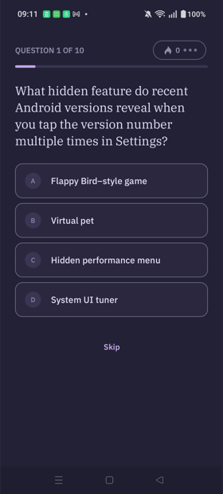
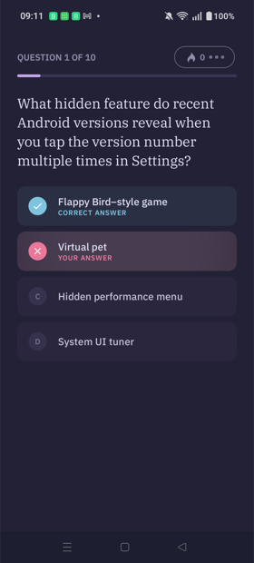
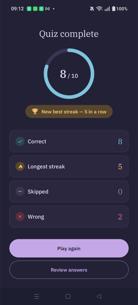
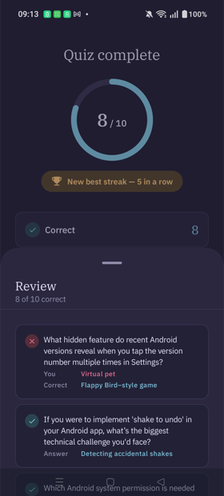
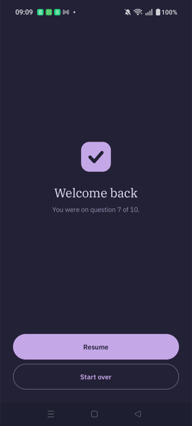

# Akwiz

A small Android quiz app. Ten multiple-choice questions, loaded from a JSON endpoint. You tap an
answer, it shows you what was right, and it keeps a running streak. At the end you get a score and
can look back at what you missed.

Built with Kotlin and Jetpack Compose.

<p>
  
  
  
  
  
</p>

<sub>Real screenshots from a phone. The device was in dark mode — there's a light theme too.</sub>

## What you can do

- **Answer questions** — tap an option and it shows the right answer next to yours, then moves on
  after 2 seconds. Or hit Skip to move on now.
- **Build a streak** — get answers right in a row and a badge lights up at 3. One wrong answer and
  it's back to zero.
- **See how you did** — a score, your longest streak, and how many you skipped or got wrong.
- **Look back** — open the review to see every question, your answer, and the right one.
- **Pick up where you left off** — close the app mid-quiz and it asks if you want to resume. Finish
  a quiz, reopen, and it shows your last score again.
- **Play offline** — if there's no internet it uses a bundled copy of the questions, so it always
  works.

## What's under the hood

- **Compose UI**, Material 3, with a hand-picked colour palette (Rosé Pine) and IBM Plex fonts.
- **Clean layers** — the data, the logic, and the screens are kept apart. The logic doesn't know
  anything about the UI, so it's all testable without a phone.
- **Loads from the network, falls back to disk, then to a bundled copy** — so it survives a bad
  connection.
- **Remembers your progress** on disk, and survives rotation and the app being killed in the
  background.
- **Works with a screen reader** — the auto-advance turns into a "Next" button so a TalkBack user
  can hear the result and move at their own pace.
- **120 tests** — the whole quiz logic, and screenshot tests that render every screen and catch
  visual changes.

## Run it

```
git clone https://github.com/yashMangal19/akwiz.git && cd akwiz
./gradlew installDebug     # with a device or emulator connected
# or open in Android Studio and press Run
```

Needs a device on Android 7 (API 24) or newer.

Run the tests with `./gradlew testDebugUnitTest`.

## How I built it

The build was planned out and done in phases — the data layer first, then the logic, then the
screens, each one tested before moving on. If you want the full story of the decisions and how it
came together, it's here:

**→ [How this was built](docs/IMPLEMENTATION.md)**

I used an AI assistant to help plan and write a lot of this — the code, the tests, the phase-by-phase
plan. There was a lot of it, and a good plan made it manageable. I reviewed every line and made
every decision myself; the AI was the execution, the direction was mine. The implementation notes
are honest about which parts are which.

---

<sub>Questions come from a <a href="https://gist.githubusercontent.com/dr-samrat/53846277a8fcb034e482906ccc0d12b2/raw">gist</a>.
Kotlin · Jetpack Compose · Material 3 · Retrofit · DataStore.</sub>
